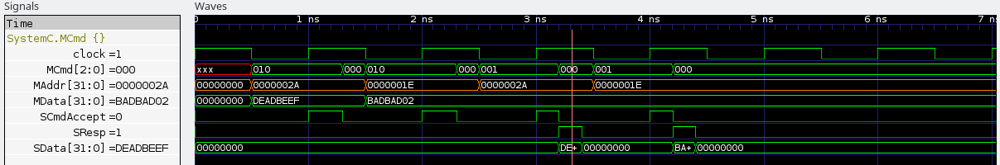

# Simple OCP Write and Read Transfer

This projects illustrate a simple read-write transfer between a processor and
a memory, implementing the Open Core Protocol (OCP).

The following OCP signals are used :

  - Clk
  - MCmd
  - MAddr
  - MData
  - SCmdAccept
  - SResp
  - SData

The RAM implements both READ and WRITE operations. It simulates a
delay of 0.3ns for writing, and 0.2ns for reading. This allows the CPU
to read data in a single clock cycle.

The following trace output illustrate compliance between this project
and the OCP specification 3, section 10.1, figure 21.

## Compilation

The projects depends on systemc.

Compile

    make

Run the simulation

    ./simulation

The trace file is writed in ``./ram_trace.vcd``
